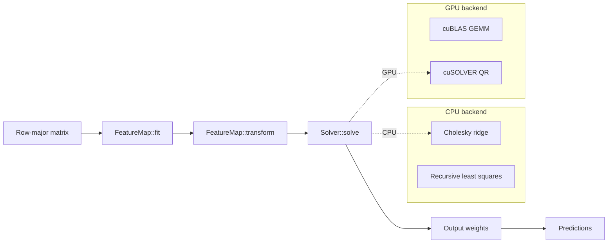
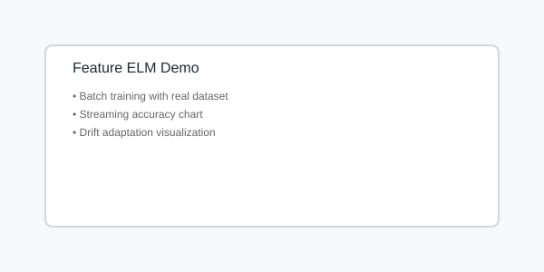

# Feature Extraction CUDA ELM

[](https://github.com/e-choness/feature_extraction_cuda_elm/actions/workflows/ci.yml)
[](https://codecov.io/gh/feature-elm/feature_extraction_cuda_elm)
[](https://developer.nvidia.com/cuda-toolkit)
[](https://en.cppreference.com/w/cpp/20)
[](https://www.docker.com/)
[](LICENSE)
[](docs/style.md)

GPU-accelerated Extreme Learning Machine (ELM) feature extraction library with online and hierarchical extensions.


## Table of Contents

- [Overview](#overview)
- [Quickstart (Docker-only)](#quickstart-docker-only)
- [Algorithms](#algorithms)
- [Demo](#demo)
- [Benchmarks](#benchmarks)
- [Repository Structure](#repository-structure)

## Overview

Feature Extraction CUDA ELM provides a composable pipeline for machine learning with Extreme Learning Machines:

- **Feature computation**: Hidden-layer transforms via `FeatureMap` interface (additive, RBF, ELM-AE)
- **Learning**: Pluggable solvers (`BatchRidgeSolver`, `RlsSolver`) with configurable options
- **Backend**: Uniform `Backend::kCpu` / `Backend::kGpu` selection



## Quickstart (Docker-only)

```bash
# Build and run tests
docker compose run --rm dev ctest --output-on-failure

# Run benchmarks
docker compose run --rm dev ./scripts/run_benchmarks.sh

# Build GPU demo image
docker build -f docker/Dockerfile.demo.gpu -t feature-elm-demo-gpu .

# Run GPU demo
docker run --rm --gpus all -p 8888:8888 feature-elm-demo-gpu

# Build CPU-only demo image
docker build -f docker/Dockerfile.demo.cpu -t feature-elm-demo-cpu .

# Run CPU demo
docker run --rm -p 8888:8888 feature-elm-demo-cpu
```

## Algorithms

| Model | Feature Stack | Solver | Notes |
|-------|-------------|--------|-------|
| Batch ELM | 1× RandomAdditiveMap (sigmoid/tanh/relu) or RbfMap | BatchRidgeSolver | Single hidden layer, ridge regression output |
| OS-ELM | RandomAdditiveMap/RbfMap | RlsSolver | Online sequential learning |
| ReOS-ELM | RandomAdditiveMap/RbfMap | RlsSolver + λ | Regularized covariance initialization |
| FOS-ELM | RandomAdditiveMap/RbfMap | RlsSolver + μ | Forgetting factor for concept drift |
| OS-CELM | RandomAdditiveMap/RbfMap | RlsSolver + constraint | Class-distance constraints |
| ML-ELM | Stacked ElmAutoEncoderLayer | BatchRidgeSolver | Multilayer learned feature extraction |
| H-OS-ELM | Stacked ElmAutoEncoderLayer | RlsSolver | Online version of ML-ELM |

### Feature Maps

- **RandomAdditiveMap**: `g(Wx + b)` with random weights, `g ∈ {sigmoid, tanh, relu}`
- **RbfMap**: Real radial basis `φᵢ(x) = exp(−‖x − cᵢ‖² / (2σ²))`
- **ElmAutoEncoderLayer**: Learned encoder via autoencoder training
- **StackedFeatureMap**: Greedy layer-by-layer composition

### Solvers

- **BatchRidgeSolver**: Ridge regression `(HᵀH + αI)β = HᵀT` via Cholesky (CPU) or QR (GPU)
- **RlsSolver**: Recursive least squares for online learning with optional regularization and forgetting

## Demo

The demo provides a web UI at http://localhost:8888 with:

- Health check endpoint showing GPU availability
- Benchmark snapshot listing
- Run inference endpoint for demo predictions
- On-demand benchmarking (GPU demo only)



## Benchmarks

<!-- BENCHMARK_TABLE_START -->
| Benchmark | CPU (items/sec) | GPU (items/sec) |
|-----------|-----------------|-----------------|
| Additive Map Transform | 55,293,872 | N/A |
| RBF Map Transform | 167,368,342 | N/A |
| ML-ELM Fit | 7,405,757 | N/A |
| Ridge Solve (Cholesky) | 660,850 | N/A |
<!-- BENCHMARK_TABLE_END -->

Benchmark results are generated from `data/benchmarks/latest/*.json` by `scripts/gen_benchmark_badge.sh`.

## Repository Structure

```
src/core/       - CPU implementations (FeatureMap, Solver, models)
src/cuda/       - GPU implementations with cuBLAS/cuSOLVER
src/io/         - Dataset loaders, preprocessing, drift stream
src/app/        - Demo HTTP server
bench/          - Google Benchmark microbenchmarks
tests/          - GoogleTest unit tests
docs/           - MkDocs + Doxygen documentation
docker/         - Docker images for dev and demo
data/datasets/  - Bundled datasets (8×8 digits)
data/benchmarks/  - Benchmark JSON output
```

## License

This project is licensed under the MIT License—see [LICENSE](LICENSE) for details.

## Citation

If you use this library in your research, please cite the software and the underlying algorithm papers. See [Citation Guide](docs/CITATION.md) for BibTeX, APA, and other citation formats, as well as references to the seminal ELM and RBF literature.
