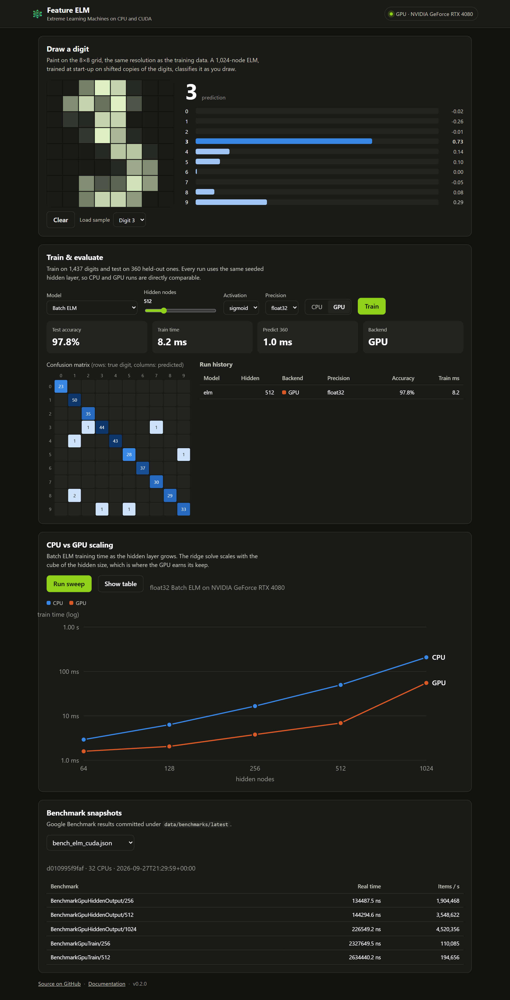
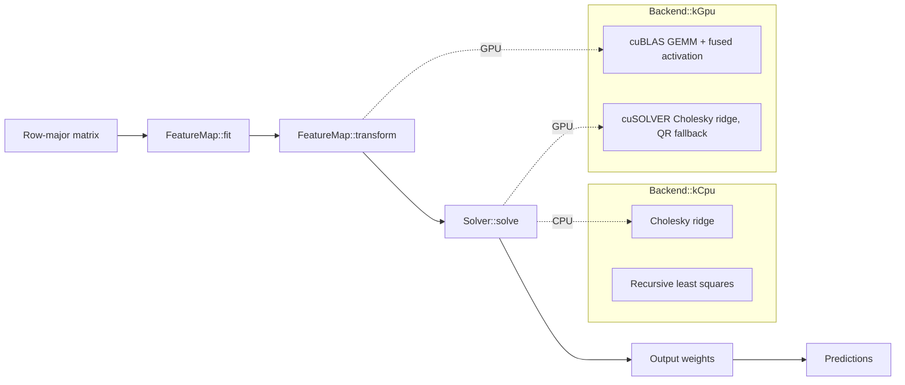

<p align="center">
  
</p>

<p align="center">
  <a href="https://github.com/e-choness/feature_extraction_cuda_elm/actions/workflows/ci.yml"></a>
  <a href="https://github.com/e-choness/feature_extraction_cuda_elm/actions/workflows/docs.yml"></a>
  <a href="https://github.com/e-choness/feature_extraction_cuda_elm/releases"></a>
  <a href="data/benchmarks/latest"></a>
  
  
  <a href="LICENSE"></a>
  
</p>

<p align="center">
  <b><a href="https://e-choness.github.io/feature_extraction_cuda_elm/">Documentation</a></b> ·
  <b><a href="https://huggingface.co/spaces/echoness/cuda-feature-extraction-elm">Live demo</a></b> ·
  <b><a href="#try-the-demo">Run it locally</a></b> ·
  <b><a href="#quickstart">Quickstart</a></b> ·
  <b><a href="https://e-choness.github.io/feature_extraction_cuda_elm/choosing-a-model">Choose a model</a></b>
</p>

**Feature ELM** is a C++20 library for **Extreme Learning Machines**: single-hidden-layer networks
whose hidden layer is random and never trained. Learning is a single regularised least-squares
solve for the output weights, so there's no back-propagation and there are no epochs. The library
adds online, drift-aware and hierarchical variants, and a CUDA backend (cuBLAS GEMM for the hidden
layer, cuSOLVER Cholesky on the normal equations for the solve) behind one `Backend::kGpu` switch.

```cpp
#include "core/elm.hpp"

feature_elm::BatchElm<float> model(/*inputs=*/64, /*hidden=*/512,
                                   feature_elm::ActivationFunction::kSigmoid,
                                   feature_elm::Backend::kGpu);  // or Backend::kCpu
model.train(trainX, trainOneHot, numTrain, /*outputs=*/10);
auto scores = model.predictBatch(testX, numTest);
```

## Try the demo

<a href="https://huggingface.co/spaces/echoness/cuda-feature-extraction-elm"></a>

The live Space runs the C++/CUDA library on a free ZeroGPU slot. It reads hand-drawn digits with a
model trained by the library on MNIST handwriting (~97% on held-out digits), and it redeploys
automatically whenever CI passes on `master`.

<p align="center">
  
</p>

Draw a digit and watch it get classified live. You can also train Batch ELM, OS-ELM or ML-ELM on
the UCI 8×8 digits dataset and compare CPU and GPU training time on a log-scale sweep.

```bash
docker run --rm -p 7860:7860 ghcr.io/e-choness/feature_extraction_cuda_elm:cpu-latest               # any machine
docker run --rm --gpus all -p 7860:7860 ghcr.io/e-choness/feature_extraction_cuda_elm:gpu-latest    # NVIDIA GPU
```

Then open <http://localhost:7860>. To host it, there is a free GPU route: a Gradio Space on Hugging
Face **ZeroGPU** that runs the same C++/CUDA library through a small C API. Docker Spaces, Modal and
Cloud Run options are compared in [Deployment](https://e-choness.github.io/feature_extraction_cuda_elm/deployment#where-to-host-a-gpu-demo).

<details>
<summary><b>Screenshot of the full demo</b></summary>



</details>

## Results

Full-size datasets on an RTX 4080 and a 32-thread i9-14900K: every configuration trains on all
60,000 training images and is scored on the 10,000 test images. The CPU side is multithreaded
(OpenMP), so these are fair comparisons.

<!-- DATASET_TABLE_START -->
| Model | Dataset | Hidden | CPU | GPU | Speed-up | Test accuracy |
|---|---|---:|---:|---:|---:|---:|
| Batch ELM | MNIST | 1,024 | 1.50 s | 375 ms | 4× | 94.0% |
| Batch ELM | MNIST | 2,048 | 2.60 s | 262 ms | 10× | 95.7% |
| Batch ELM | MNIST | 4,096 | 8.68 s | 539 ms | 16× | 96.9% |
| Batch ELM | Fashion-MNIST | 1,024 | 1.22 s | 274 ms | 4× | 84.5% |
| Batch ELM | Fashion-MNIST | 2,048 | 2.96 s | 255 ms | 12× | 86.0% |
| Batch ELM | Fashion-MNIST | 4,096 | 8.81 s | 486 ms | 18× | 87.6% |
| OS-ELM (stream) | MNIST | 1,024 | 28.74 s | 459 ms | 63× | 94.0% |
| OS-ELM (stream) | MNIST | 2,048 | 293.03 s | 1.05 s | 279× | 95.7% |

<sub>60,000 training images (784 inputs), float32, trained once; accuracy on the 10,000 test images. CPU uses all threads (OpenMP).</sub>
<!-- DATASET_TABLE_END -->

OS-ELM streams the same data in chunks and ends at exactly Batch ELM's accuracy. Its recursive
least-squares state stays on the GPU between chunks. Regenerate with `python3
scripts/fetch_datasets.py && ./scripts/run_benchmarks.sh && ./scripts/gen_benchmark_badge.sh`.
Per-request timings for the small digits demo are in [docs/demos.md](docs/demos.md#evaluation-results).

<details>
<summary><b>Google Benchmark micro-benchmarks</b> (generated from <code>data/benchmarks/latest</code>)</summary>

<!-- BENCHMARK_TABLE_START -->
| Benchmark | CPU | GPU |
|---|---:|---:|
| Batch ELM train, 256 hidden | 11.6 ms | 1.66 ms |
| Batch ELM train, 512 hidden | 34.6 ms | 2.33 ms |
| Batch ELM train, 1024 hidden | 90.3 ms | 3.84 ms |
| Batch ELM train, 2048 hidden | 288.6 ms | 6.94 ms |
| Hidden-layer transform, 1024 hidden | 3.53 ms | 4.39 ms |
| Hidden-layer transform, 4096 hidden | 9.39 ms | 3.97 ms |
| Ridge solve, 256 features | 0.49 ms (Cholesky) | 0.56 ms (cuSOLVER Cholesky) |
| RBF map transform, 2048 | 0.56 ms | — |
| ML-ELM fit, 1024 | 0.34 ms | — |
| RLS update, 256 | 0.42 ms | — |

<sub>Wall time per call (2048 samples, 64 inputs, float32), lower is better. Recorded 2026-09-28 with 32 CPU threads (OpenMP) and an RTX 4080.</sub>
<!-- BENCHMARK_TABLE_END -->

On these 2,048-sample micro-benchmarks, the GPU trains Batch ELM 7× faster at 256 hidden units and
42× faster at 2,048, against a 32-thread CPU. A tiny isolated ridge solve (256 features) is a tie,
because fixed launch and transfer costs dominate at that size.
Regenerate with `./scripts/run_benchmarks.sh && ./scripts/gen_benchmark_badge.sh`, then
`node scripts/gen_banner.mjs` to refresh the banner's numbers.

</details>

## Quickstart

Everything builds and tests inside Docker. You need Docker and, for GPU tests, the NVIDIA
Container Toolkit.

```bash
docker compose run --rm dev ctest --output-on-failure        # CUDA toolchain; GPU tests skip
docker compose run --rm dev-gpu ctest --output-on-failure    # with your GPU attached
docker compose run --rm dev ./scripts/style_check.sh         # clang-format + clang-tidy
docker compose run --rm dev-gpu ./scripts/run_benchmarks.sh  # refresh data/benchmarks/latest
npm ci && npm run docs:dev                                   # docs site on http://localhost:5173
```

Without Docker, a CPU-only build needs a C++20 compiler, CMake ≥ 3.24 and GoogleTest:
`cmake -S . -B build -DENABLE_CUDA=OFF && cmake --build build && ctest --test-dir build`.

## Algorithms

| Model | Feature stack | Solver | Use it for |
|---|---|---|---|
| Batch ELM | `RandomAdditiveMap` (sigmoid / tanh / relu) or `RbfMap` | `BatchRidgeSolver` | Fast offline training |
| OS-ELM | `RandomAdditiveMap` / `RbfMap` | `RlsSolver` | Data arriving in chunks |
| ReOS-ELM | `RandomAdditiveMap` / `RbfMap` | `RlsSolver` + λ | Small initial blocks |
| FOS-ELM | `RandomAdditiveMap` / `RbfMap` | `RlsSolver` + forgetting μ | Concept drift |
| OS-CELM | `RandomAdditiveMap` / `RbfMap` | `RlsSolver` + class constraint | Class-imbalanced streams |
| ML-ELM | stacked `ElmAutoEncoderLayer` | `BatchRidgeSolver` | Learned multilayer features |
| H-OS-ELM | stacked `ElmAutoEncoderLayer` | `RlsSolver` | Online version of ML-ELM |


```mermaid
flowchart LR
    Data[Row-major matrix] --> Fit[FeatureMap::fit]
    Fit --> Transform[FeatureMap::transform]
    Transform --> Solve[Solver::solve]
    Solve --> Weights[Output weights]
    Weights --> Predict[Predictions]

    subgraph CPU[Backend::kCpu]
        Cholesky[Cholesky ridge]
        RLS[Recursive least squares]
    end

    subgraph GPU[Backend::kGpu]
        GEMM[cuBLAS GEMM + fused activation]
        QR[cuSOLVER Cholesky ridge, QR fallback]
    end

    Transform -. GPU .-> GEMM
    Solve -. CPU .-> Cholesky
    Solve -. GPU .-> QR
```

## Repository structure

```text
src/core/          FeatureMap, Solver and model implementations (CPU)
src/cuda/          CUDA backend: cuBLAS/cuSOLVER kernels, CPU stubs for non-CUDA builds
src/io/            CSV loader, preprocessing, drift streams
src/app/           Demo server (cpp-httplib + nlohmann/json)
src/capi/          C API (libfeature_elm_capi.so) for dynamic hosts such as the ZeroGPU Space
demo/ui/           Demo web UI (vanilla JS, no build step)
tests/             GoogleTest suites, including CPU/GPU parity tests
bench/             Google Benchmark suites
docs/              VitePress site (npm run docs:dev)
docker/            Dev image (CUDA 13.4) and CPU/GPU demo images
deploy/huggingface Hugging Face Spaces: ZeroGPU (Gradio) and Docker (CPU, GPU) templates
data/              Digits dataset and benchmark snapshots
```

## License and citation

MIT licensed; see [LICENSE](LICENSE). If you use this library in research, please cite the software
and the underlying ELM papers. BibTeX and APA are in the [citation guide](docs/CITATION.md).
