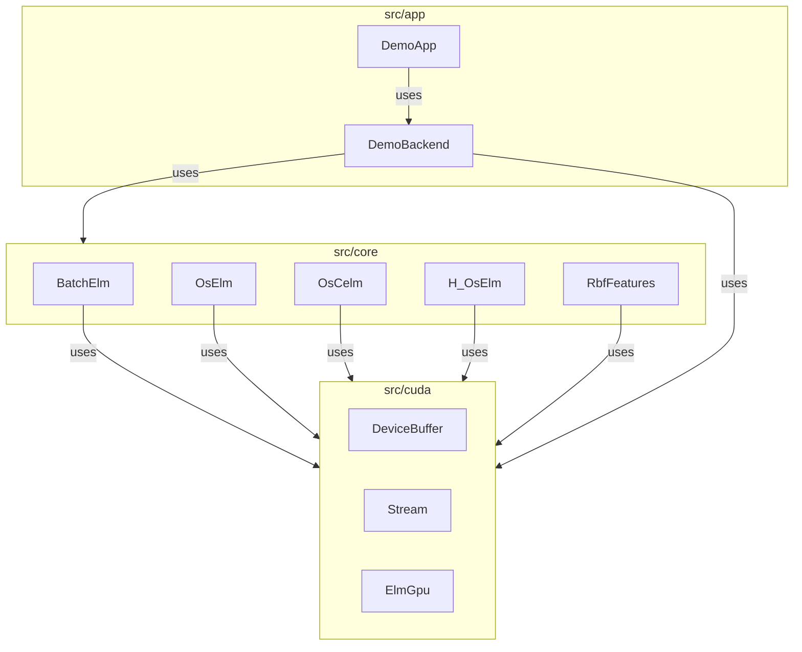
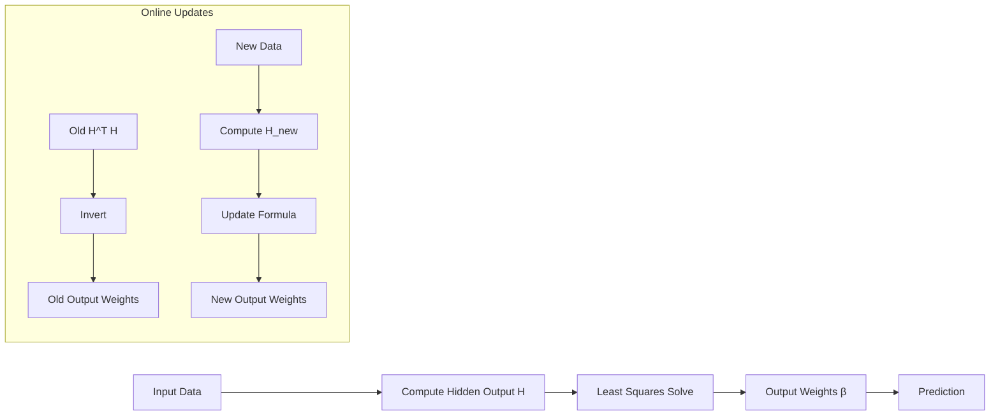
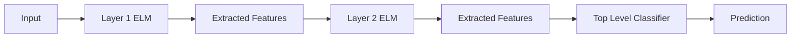
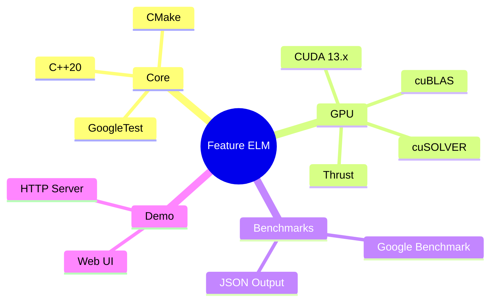

# Documentation

This directory contains documentation for the Feature Extraction CUDA ELM project.

## Algorithm Overviews

- [Batch ELM](batch_elm.md) - Single hidden layer feedforward network with random hidden weights
- [OS-ELM](os_elm.md) - Online Sequential ELM for incremental learning
- [OS-CELM](os_celm.md) - Constrained OS-ELM with class-distance constraints
- [H-OS-ELM](h_os_elm.md) - Hierarchical OS-ELM with stacked feature extraction
- [RBF Features](rbf_features.md) - Radial Basis Function feature mapping

## Usage Guides

- [Benchmarks](benchmarks.md) - Running and interpreting microbenchmarks
- [Demos](demos.md) - Using the GPU and CPU demo servers
- [API](api.md) - Library API reference

## Architecture

## Dataflow

### OS-ELM

### H-OS-ELM

## Tech Stack Mindmap

