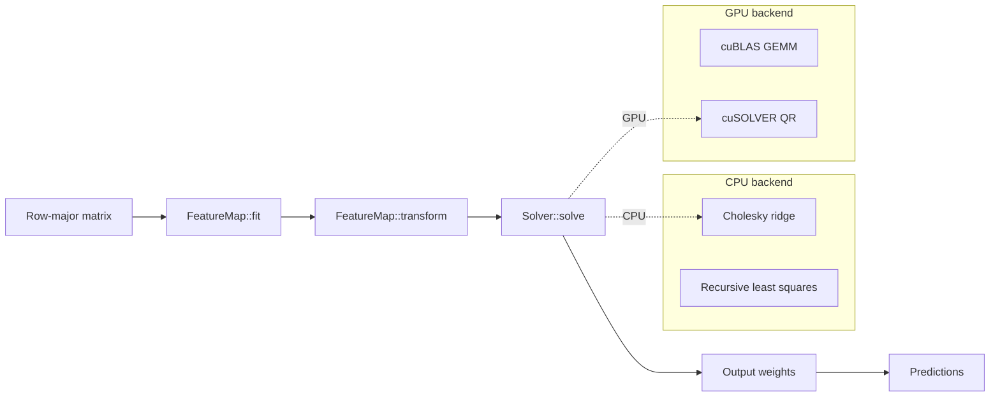

# Architecture

The v2 architecture is a thin composition:

```text
Data -> FeatureMap stack -> Solver -> Predictions
```

Models do not duplicate hidden-layer math. Feature computation lives in `FeatureMap`; learning lives in `Solver`; backend selection is passed uniformly through the pipeline.

## Pipeline



## Feature maps

`FeatureMap<FloatT>` is the single home for feature computation.

| Map | Learns parameters? | Use |
|---|---|---|
| `IdentityMap` | No | Linear baseline and ablations |
| `RandomAdditiveMap` | No | Standard additive ELM hidden layer |
| `RbfMap` | Centers during `fit` | Center-based radial basis features |
| `ElmAutoEncoderLayer` | Yes | Learned encoder for feature extraction |
| `StackedFeatureMap` | Yes, layer by layer | ML-ELM and H-OS-ELM feature stacks |

## Solver strategies

| Solver | Training mode | Main options |
|---|---|---|
| `BatchRidgeSolver` | Batch | `ridgeAlpha`, primal/dual path, Cholesky/QR |
| `RlsSolver` | Online | regularization, forgetting, class-distance constraint |

## Backend

`Backend::kCpu` is the correctness reference. `Backend::kGpu` routes heavy primitives through the CUDA primitive layer. The public model API stays backend-neutral.
