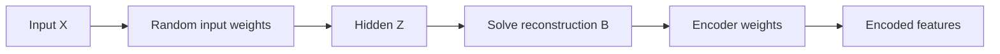

# ELM-AE

`ElmAutoEncoderLayer` is a learned `FeatureMap`. It trains an ELM autoencoder with the input as its own target, then derives an encoder for downstream layers.

## Math

An ELM-AE layer computes hidden activations:

```text
Z = g(XW + b)
```

It solves output weights `B` for reconstruction:

```text
minB ||ZB - X||² + α||B||²
```

The encoder used by downstream layers is derived from the learned autoencoder output weights using the implementation's transpose convention:

```text
features = activation(Z_encoder * B_encoder + b_encoder)
```

The layer is still an ELM-style layer: input weights are random, but the output-side encoder is learned from data.

## API

```cpp
feature_elm::ElmAutoEncoderLayer<float> layer(
    inputDim,
    outputDim,
    feature_elm::ActivationKind::kSigmoid,
    42u,
    1e-6f);

layer.fit(trainData, numSamples);

std::vector<float> features;
layer.transform(trainData, numSamples, &features);
```

## Architecture



## When to use

- Learned feature extraction is needed.
- A single additive ELM layer underfits.
- You need a stackable layer for [ML-ELM](ml_elm.md) or [H-OS-ELM](elm_ae.md).

## Notes

- The layer reconstructs its input during `fit`.
- The encoder is frozen after fitting.
- Use `ridgeAlpha` to stabilize the autoencoder solve.
