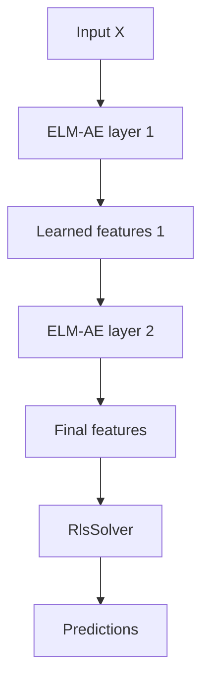

# H-OS-ELM

H-OS-ELM is an online model that stacks learned ELM-AE feature layers and trains the final head with `RlsSolver`.

## Architecture



## API

```cpp
feature_elm::HierarchicalOsElm<double> model(
    numInputs,
    {64, 32},
    feature_elm::ActivationFunction::kSigmoid,
    feature_elm::Backend::kCpu,
    feature_elm::RlsOptions<double>{},
    1e-6,
    42u);

model.initialize(trainData, trainTargets, numSamples, numOutputs);
model.update(newData, newTargets, newSamples);
auto predictions = model.predictBatch(testData, testSamples);
```

## Behavior

- `initialize` fits the ELM-AE stack greedily on the initialization data.
- `update` consumes the learned features from new chunks and updates only the online RLS head.
- `featureStack()` exposes the learned stack for inspection and tests.
- ReOS-ELM, FOS-ELM, and OS-CELM toggles are attached through `RlsOptions`.

## When to use

- Data arrives online and learned feature extraction is needed.
- A single online additive layer is not expressive enough.
- You need to compare online learned features against batch [ML-ELM](ml_elm.md).

## When not to use

- Full-batch training is acceptable and simpler: use `MlElm`.
- You only need a random additive baseline: use `OsElm`.
