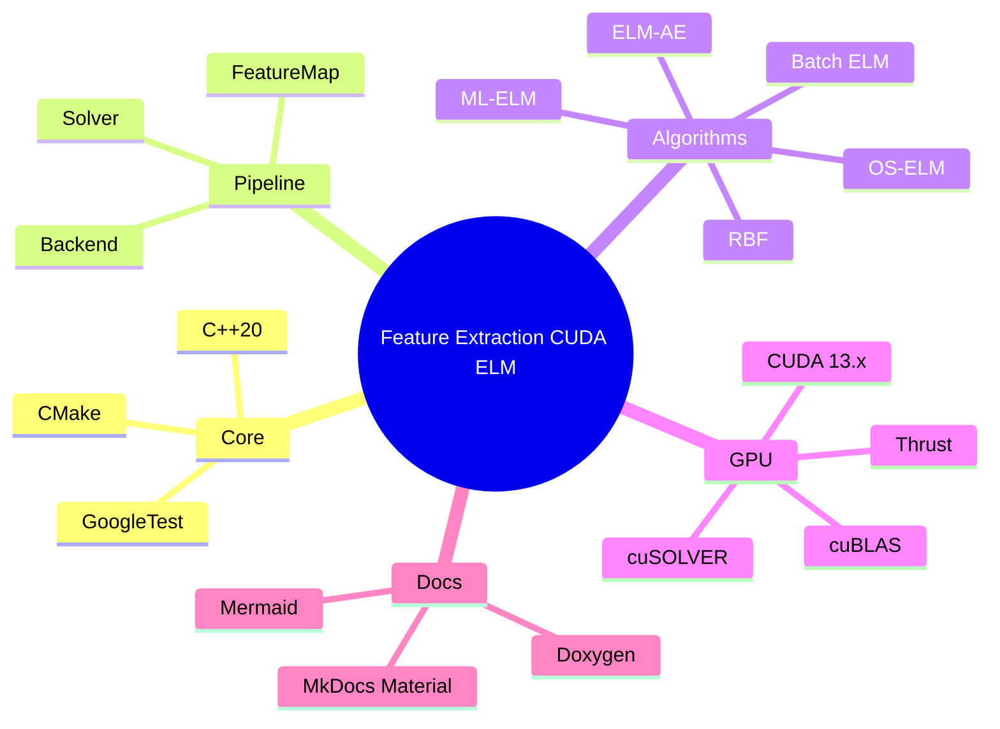

# Feature Extraction CUDA ELM Documentation

GPU-accelerated Extreme Learning Machine feature extraction with composable feature maps, solver strategies, and CPU/GPU backends.

## Sections

### Getting started

- [Getting started](getting-started.md)
- [Quickstart](quickstart.md)
- [Choosing a model](choosing-a-model.md)

### Concepts and architecture

- [Architecture](architecture.md)
- [Batch ELM](elm.md)
- [OS-ELM](os_elm.md)
- [ReOS-ELM and FOS-ELM](reos_fos_elm.md)
- [OS-CELM](os_celm.md)
- [ELM-AE](elm_ae.md)
- [ML-ELM](ml_elm.md)
- [RBF features](rbf.md)

### Operations and contributor guides

- [Deployment](deployment.md)
- [Troubleshooting](troubleshooting.md)
- [Building](building.md)
- [Testing](testing.md)
- [Style](style.md)
- [Demos](demos.md)
- [Benchmarks](benchmarks.md)
- [Migration from v1 to v2](migration-v1-to-v2.md)
- [Glossary](glossary.md)
- [Roadmap](roadmap.md)

### License and citation

- [License](https://github.com/e-choness/feature_extraction_cuda_elm/blob/main/LICENSE) – MIT License
- [Citation Guide](CITATION.md) – How to cite this project and underlying algorithms

## Tech stack mindmap

## References

- Huang, Guang-Bin, Qin-Yu Zhu, and Chee-Kheong Siew. 2006. Extreme learning machine: theory and applications.
- Liang, Nan-Ying, Guang-Bin Huang, P. Saratchandran, and N. Sundararajan. 2006. A fast and accurate online sequential learning algorithm for feedforward networks.
- Kasun, L. L. C., Yang Yang, Guang-Bin Huang, and Zhiping Zhou. 2013. Extreme learning machine for multilayer perceptron and autoencoder feature learning.
- Broomhead, David S., and David Lowe. 1988. Multivariable functional interpolation and adaptive networks.
- Moody, John, and Christian J. Darken. 1989. Fast learning in networks of locally-tuned processing units.
