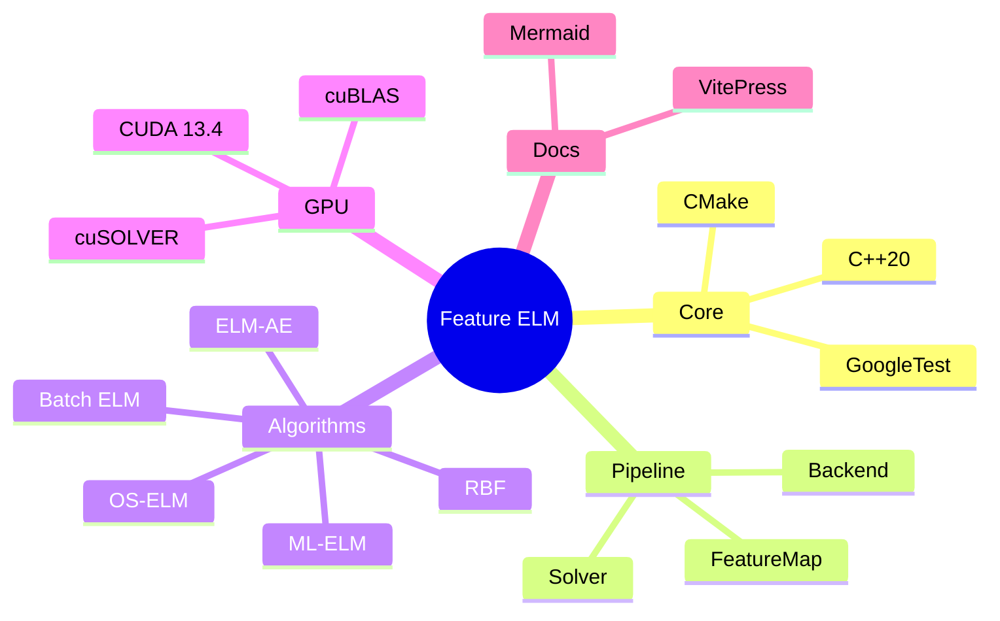

## Tech stack

```mermaid
mindmap
  root((Feature ELM))
    Core
      C++20
      CMake
      GoogleTest
    Pipeline
      FeatureMap
      Solver
      Backend
    Algorithms
      Batch ELM
      OS-ELM
      ELM-AE
      ML-ELM
      RBF
    GPU
      CUDA 13.4
      cuBLAS
      cuSOLVER
    Docs
      VitePress
      Mermaid
```

## License and citation

- [License](./LICENSE.md): MIT License
- [Citation guide](./CITATION.md): how to cite this project and the underlying algorithms

## References

- Huang, Guang-Bin, Qin-Yu Zhu, and Chee-Kheong Siew. 2006. Extreme learning machine: theory and applications.
- Liang, Nan-Ying, Guang-Bin Huang, P. Saratchandran, and N. Sundararajan. 2006. A fast and accurate online sequential learning algorithm for feedforward networks.
- Kasun, L. L. C., Yang Yang, Guang-Bin Huang, and Zhiping Zhou. 2013. Extreme learning machine for multilayer perceptron and autoencoder feature learning.
- Broomhead, David S., and David Lowe. 1988. Multivariable functional interpolation and adaptive networks.
- Moody, John, and Christian J. Darken. 1989. Fast learning in networks of locally-tuned processing units.
