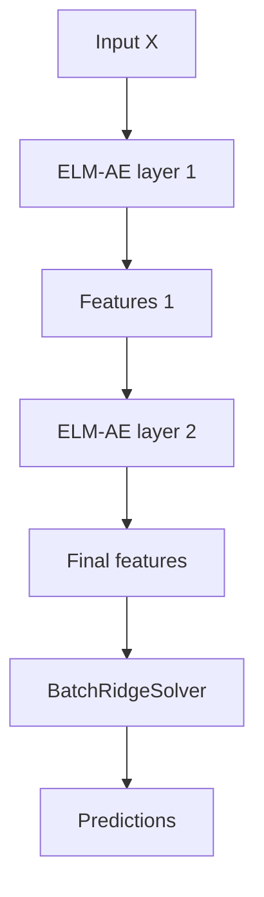

# ML-ELM

ML-ELM is a batch model that stacks learned ELM-AE feature maps and trains a ridge classifier on the final representation.

## Dataflow



## API

```cpp
feature_elm::MlElm<float> model(
    numInputs,
    {64, 32},
    feature_elm::ActivationFunction::kSigmoid,
    feature_elm::Backend::kCpu,
    1e-6f,
    42u);

model.train(trainData, trainTargets, numSamples, numOutputs);
auto predictions = model.predictBatch(testData, testSamples);
```

`MlElm` owns a `StackedFeatureMap` and a `BatchRidgeSolver`. The feature stack is fitted greedily layer by layer during `train`; the final classifier is trained once on the final features.

## When to use

- The target function is nonlinear and not well captured by one additive ELM layer.
- You want learned feature extraction without backpropagation.
- Batch training is acceptable.

## Comparison baseline

Compare against:

- [Batch ELM](elm.md) with the same number of final features.
- [RBF features](rbf.md) when local center geometry is expected.
- [H-OS-ELM](h_os_elm.md) when the final head must be online.

## Practical tips

- Keep the first layer at least as wide as the input for reconstruction-heavy tasks.
- Use a smaller second layer to force a compact representation.
- Increase `ridgeAlpha` if reconstruction or classifier solve is unstable.
