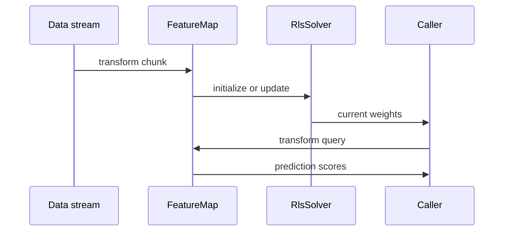

# OS-ELM

Online Sequential ELM updates the output layer as new chunks arrive without retraining on all historical data.

## Math

The feature map is fixed after initialization:

```text
H_i = g(X_iW + b)
```

The online head maintains weights `β` and covariance `P`. For each chunk, it applies recursive least squares:

```text
K = P Hᵀ (I + H P Hᵀ)^(-1)
β ← β + K(T - Hβ)
P ← μ^(-1)(P - K H P)
```

When `forgettingFactor = 1`, this is ordinary OS-ELM.

## API

```cpp
feature_elm::OsElm<float> model(
    numInputs,
    numHiddenNodes,
    feature_elm::ActivationFunction::kSigmoid,
    feature_elm::Backend::kCpu,
    feature_elm::RlsOptions<float>{});

model.initialize(initialData, initialTargets, initialSamples, numOutputs);
model.update(newData, newTargets, newSamples);
auto prediction = model.predict(input);
```

## Streaming flow



## When to use

- Data arrives in chunks.
- Full batch retraining is too slow.
- You need a baseline for forgetting-factor drift adaptation.

## Related

- [ReOS-ELM and FOS-ELM](reos_fos_elm.md) for regularization and forgetting.
- [OS-CELM](os_celm.md) for class-distance constraints.
