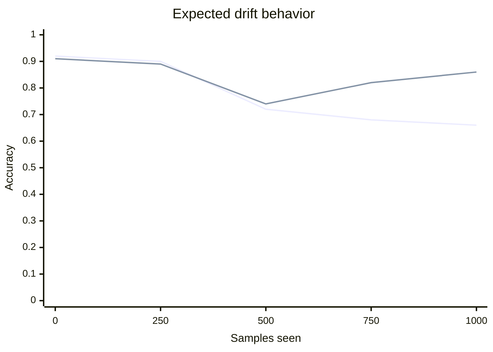

# ReOS-ELM and FOS-ELM

ReOS-ELM and FOS-ELM are not separate classes in v2. They are toggles on `RlsOptions<FloatT>`.

## ReOS-ELM

ReOS-ELM regularizes the initial covariance used by the online solver.

```cpp
feature_elm::RlsOptions<float> options;
options.regularization = 1e-2f;
options.forgettingFactor = 1.0f;
options.constraint = feature_elm::RlsConstraint::kNone;
```

Use it when:

- The initial chunk is small.
- The hidden feature matrix is ill-conditioned.
- Early online updates produce unstable weights.

The extension is off when `regularization = 0`.

## FOS-ELM

FOS-ELM applies a forgetting factor to down-weight stale data.

```cpp
feature_elm::RlsOptions<float> options;
options.regularization = 0.0f;
options.forgettingFactor = 0.98f;
options.constraint = feature_elm::RlsConstraint::kNone;
```

Use it when:

- The stream distribution changes over time.
- Recent labels are more informative than old labels.
- You need to compare against ordinary OS-ELM.

The extension is off when `forgettingFactor = 1`.

## Drift comparison



FOS-ELM should recover faster after the configured drift point because older chunks receive lower weight.

## References

- Liang, Huang, Saratchandran, and Sundararajan. 2006. OS-ELM.
- Online sequential learning and forgetting-factor variants in the ELM literature.
